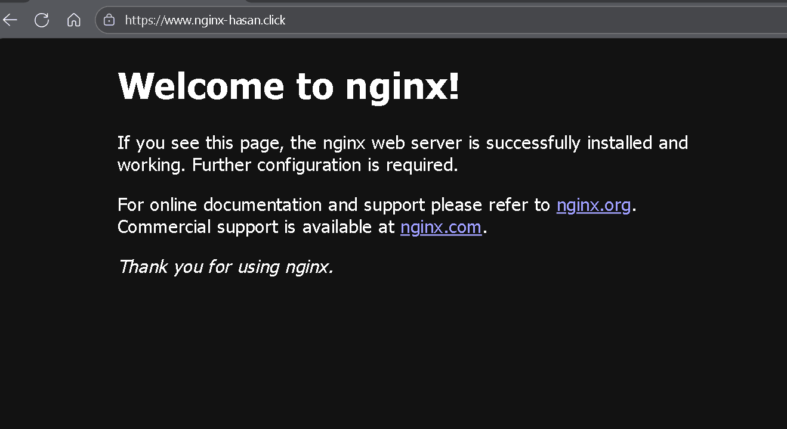

# NGINX Web Server on AWS EC2

[](https://aws.amazon.com/ec2/)
[](https://nginx.org/)
[](https://aws.amazon.com/route53/)

Deployed and operated an NGINX web server on AWS EC2, configured DNS with Route 53, and secured the service using Let’s Encrypt (Certbot) TLS certificates for HTTPS.

<p align="center">
  
</p>

---

## Project Overview
This project demonstrates an end-to-end setup of an NGINX web server on AWS:
1. Launch EC2 (Ubuntu)  
2. Install and run NGINX  
3. Configure DNS in Route 53  
4. Enable HTTPS with Certbot

---

## Setup Steps

### 1. Launch an EC2 Instance
- Used: **Ubuntu 22.04 LTS (Free Tier)**
- Ports opened in the **Security Group**:
  - 22 (SSH) — management access via EC2 Instance Connect  
  - 80 (HTTP) — web + Let’s Encrypt validation  
  - 443 (HTTPS) — encrypted web traffic  

> [!IMPORTANT]  
> For production, never leave port 22 open to the world.  
> Restrict it to your IP or replace SSH entirely with **AWS SSM Session Manager**.

### 2. Install and Verify NGINX
```bash
sudo apt update && sudo apt install nginx -y
sudo systemctl status nginx   # should show “active (running)”
```
Visit your instance’s public IP — you should see the NGINX default welcome page.

> [!NOTE]
> The NGINX service starts automatically after installation, but you can manually start or enable it with `sudo systemctl start nginx` and `sudo systemctl enable nginx` if needed.

### 3. Connect a Custom Domain (Route 53)
Created a **public hosted zone** for `nginx-hasan.click`.

| Record | Type | Value | TTL |
|--------|------|--------|-----|
| `@` | A | `18.208.141.6` | 300 |
| `www` | CNAME | `nginx-hasan.click` | 300 |

### 4. Secure with Let’s Encrypt (Certbot)
- Install dependencies using `sudo apt install certbot python3-certbot-nginx -y`.  
- Then issue certificates with `sudo certbot --nginx`.  
- When prompted, enter `example.com www.example.com` and select **Redirect HTTP to HTTPS**.  
- Verify with `sudo certbot certificates` and test renewal using `sudo certbot renew --dry-run`.

> [!NOTE]  
> Certificates are valid for **90 days** and renew automatically through a systemd timer.  
> Use `sudo systemctl list-timers | grep certbot` to confirm.

---

## Security Group Rules
| Type | Port | Source | Purpose |
|------|------|---------|----------|
| SSH | 22 | 0.0.0.0/0 | Temporary for EC2 Instance Connect |
| HTTP | 80 | 0.0.0.0/0 | Web traffic + ACME validation |
| HTTPS | 443 | 0.0.0.0/0 | Encrypted web access |

> [!IMPORTANT]  
> In production, restrict SSH to a trusted IP or switch to Session Manager.

---

## Notes on Costs
| Service | Est. Cost | Notes |
|----------|------------|-------|
| EC2 (t2.micro) | Free Tier | Charged hourly after limit |
| Route 53 Hosted Zone | ~$0.50/mo | Small DNS charge |
| DNS queries | ~$0.40/million | Negligible |
| Let’s Encrypt | Free | Auto-renewal built in |
